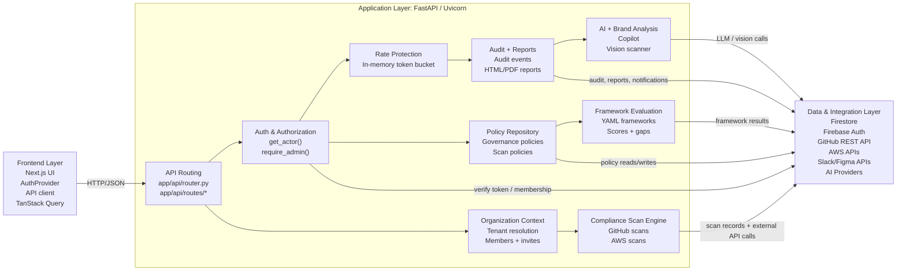
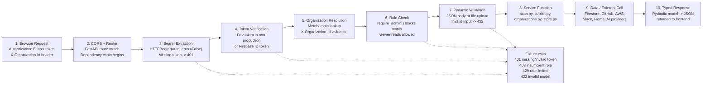

```mermaid
flowchart LR
    A["Frontend Scans Page<br/>User clicks Run Scan"]
    B["POST /api/v1/scans<br/>ScanTriggerRequest<br/>github_org + scope"]
    C["Security Dependencies<br/>get_actor()<br/>RateLimited(expensive)"]
    D["Scan Engine<br/>app/services/scan.py"]

    E["Firestore Store<br/>GitHub connection<br/>scan policies<br/>systems"]
    F["Secret Decryption<br/>decrypt_secret()<br/>Fernet token recovery"]
    G["GitHub REST API<br/>repos, branches,<br/>security settings,<br/>Copilot org data"]
    H["Evidence Snapshot<br/>repo-level facts<br/>org-level facts"]

    I["Enabled Checks<br/>branch protection<br/>PR reviews<br/>secret scanning<br/>Copilot controls"]
    J["Evaluate Findings<br/>ScanViolation objects<br/>compliant vs violation"]
    K["Optional Custom Policy AI<br/>Claude evaluation<br/>only when configured"]
    L["Score + Record<br/>compliance_score<br/>ScanRecord"]

    M["Persist Result<br/>store.save_scan()<br/>link_scan_to_systems()"]
    N["Report / Framework Ready<br/>HTML/PDF report<br/>framework evaluation"]
    O["Frontend Updates<br/>query invalidation<br/>scan detail display"]

    A --> B --> C --> D
    D --> E --> F --> G --> H
    E -->|"enabled policy toggles"| I
    H -->|"evidence"| J
    I --> J --> K --> L
    L --> M --> N --> O
```

# TrustFabric DDS Section 4 Application Layer Diagram Pack

This file contains ready-to-use figure descriptions, Mermaid diagrams, and image-generation prompts for the TrustFabric Detailed Design Specification Section 4: Application Layer Subsystems.

The generated PNG files in this folder are:

- `application_layer_topology.png`
- `authenticated_request_lifecycle.png`
- `github_compliance_scan_data_flow.png`

Recommended placement in the DDS:

- Put `application_layer_topology.png` near the Application Layer overview, before Section 4.4.
- Put `authenticated_request_lifecycle.png` in Section 4.5 after the request/response lifecycle text.
- Put `github_compliance_scan_data_flow.png` in Section 4.8 or near the Compliance Scan Engine subsection.

## Figure 1: Application Layer Subsystem Topology

Caption:

Figure X: Application Layer subsystem topology showing the FastAPI backend between the Next.js Frontend Layer and the Data and Integration Layer. The center box contains the main Application Layer modules: API routing, authentication and authorization, organization context, policy repository, scan engine, framework evaluation, AI/brand analysis, audit/reporting, and rate protection.

Purpose:

This diagram gives the reader a high-level map of what lives inside the Application Layer. It should look similar in spirit to the Frontend Layer subsystem relationship diagram, but it does not need every file or endpoint. The important idea is that the frontend only talks to FastAPI, and FastAPI is the controlled gateway to Firestore, Firebase Auth, GitHub, AWS, Slack, Figma, and AI providers.

Mermaid:

Image-generation prompt:

Create a clean technical architecture diagram for a university Detailed Design Specification. Use a white or very light gray background, thin dark outlines, rounded rectangles, and restrained pastel colors. The diagram title is "Application Layer Subsystem Topology". Show three vertical regions from left to right:

1. Frontend Layer: Next.js UI, AuthProvider, API client, TanStack Query.
2. Application Layer: FastAPI / Uvicorn. Inside this region, show nine subsystem boxes arranged in a 3 by 3 grid:
   - API Routing: app/api/router.py, app/api/routes/*
   - Auth & Authorization: get_actor(), require_admin()
   - Rate Protection: in-memory token bucket
   - Organization Context: tenant resolution, members + invites
   - Policy Repository: governance policies, scan policies
   - Audit + Reports: audit events, HTML/PDF reports
   - Compliance Scan Engine: GitHub scans, AWS scans
   - Framework Evaluation: YAML frameworks, scores + gaps
   - AI + Brand Analysis: copilot, vision scanner
3. Data & Integration Layer: Firestore, Firebase Auth, GitHub REST API, AWS APIs, Slack/Figma APIs, AI Providers.

Draw arrows from Frontend Layer to API Routing labeled "HTTP/JSON". Draw arrows from Application Layer services to Data & Integration Layer labeled "auth/store", "queries", "API calls", and "persist + notify". The visual style should match academic software architecture diagrams, not a marketing graphic.

## Figure 2: Authenticated Request Lifecycle

Caption:

Figure X: Application Layer protected request lifecycle. A request from the frontend is routed through CORS, bearer-token extraction, token verification, organization resolution, role checking, Pydantic validation, service execution, and typed JSON response generation. Failure exits return HTTP 401, 403, 429, or 422 before the route handler completes.

Purpose:

This diagram belongs near the API Routing and Authentication subsections. It explains how FastAPI dependencies are used as the backend's security and validation pipeline.

Mermaid:

Image-generation prompt:

Create a horizontal workflow diagram titled "Authenticated Request Lifecycle". Use numbered rounded rectangles connected by arrows. The steps are:

1. Browser Request: Authorization bearer token, X-Organization-Id header.
2. CORS + Router: FastAPI route match and dependency chain.
3. Bearer Extraction: HTTPBearer(auto_error=False), missing token returns 401.
4. Token Verification: dev token in non-production or Firebase ID token.
5. Organization Resolution: membership lookup and X-Organization-Id validation.
6. Role Check: require_admin() blocks writes, viewer reads allowed.
7. Pydantic Validation: JSON body or file upload, invalid input returns 422.
8. Service Function: scan.py, copilot.py, organizations.py, store.py.
9. Data/External Call: Firestore, GitHub, AWS, Slack, Figma, AI providers.
10. Typed Response: Pydantic model serialized as JSON and returned to the frontend.

Add a separate red or pink "Failure exits" box listing: 401 missing/invalid token, 403 insufficient organization role, 429 rate limited, and 422 invalid request model. Use dashed red arrows from token extraction, token verification, role check, and validation to the failure box. Keep the design simple and academic.

## Figure 3: GitHub Compliance Scan Data Flow

Caption:

Figure X: GitHub compliance scan data flow through the Application Layer. The scan route authenticates the user, applies rate limiting, loads organization-scoped integration credentials and scan policies, gathers repository evidence from GitHub, evaluates enabled checks, optionally evaluates custom policies through AI, persists the ScanRecord, and returns the result to the frontend.

Purpose:

This diagram belongs in the Compliance Scan Engine subsection. It is the most concrete workflow diagram for the Application Layer because it shows how authentication, persistence, external integrations, policies, scoring, reporting, and frontend updates work together.

Mermaid:

Image-generation prompt:

Create a clean data-flow diagram titled "GitHub Compliance Scan Data Flow". Use three horizontal rows. Row 1 shows the frontend request entering the backend: Frontend Scans Page -> POST /api/v1/scans -> Security Dependencies -> Scan Engine. Row 2 shows evidence collection: Firestore Store -> Secret Decryption -> GitHub REST API -> Evidence Snapshot. Row 3 shows evaluation and output: Enabled Checks -> Evaluate Findings -> Optional Custom Policy AI -> Score + Record -> Persist Result -> Report/Framework Ready -> Frontend Updates.

Include these details inside the boxes:

- Frontend Scans Page: User clicks Run Scan.
- POST /api/v1/scans: ScanTriggerRequest with github_org and scope.
- Security Dependencies: get_actor() and RateLimited(expensive).
- Scan Engine: app/services/scan.py.
- Firestore Store: GitHub connection, scan policies, systems.
- Secret Decryption: decrypt_secret(), Fernet token recovery.
- GitHub REST API: repositories, branch protection, security settings, Copilot org data.
- Evidence Snapshot: repo-level facts and org-level facts.
- Enabled Checks: branch protection, PR reviews, secret scanning, Copilot controls.
- Evaluate Findings: ScanViolation objects split into compliant and violation results.
- Optional Custom Policy AI: Claude policy evaluation only when configured.
- Score + Record: compliance_score and ScanRecord.
- Persist Result: store.save_scan(), link_scan_to_systems().
- Report/Framework Ready: HTML/PDF report and framework evaluation.
- Frontend Updates: query invalidation and scan detail display.

Use neutral academic styling, readable labels, and arrows that do not cross heavily.

## Notes For Accuracy

Use these repo-accurate terms:

- The backend root folder is `app/`, not `backend/`.
- The FastAPI application is created in `app/main.py`.
- Routers are registered in `app/api/router.py`.
- Security is implemented in `app/core/security.py`.
- The authenticated request object is `Actor`, not `VerifiedUser`.
- The GitHub scan engine is `app/services/scan.py`.
- The AWS scan engine is `app/services/aws_scan.py`.
- Firestore access is centralized in `app/services/store.py`.
- Integration tokens are encrypted and decrypted using `app/core/secrets.py`.
- Framework evaluation is data-driven through YAML files in `app/frameworks/`.
- AI provider routing is handled by `app/services/copilot.py`.
- Brand compliance vision analysis is handled by `app/services/brand_compliance.py`.
- Rate limiting is in-memory token bucket logic in `app/core/rate_limit.py`.

Avoid these inaccurate terms unless the code changes later:

- `backend/`
- `VerifiedUser`
- `risk_scorer.py`
- async Firestore `AsyncClient`
- Claude-only AI architecture
- direct frontend-to-Firestore access
- Cloud Storage persistence for brand scan images as a current feature
